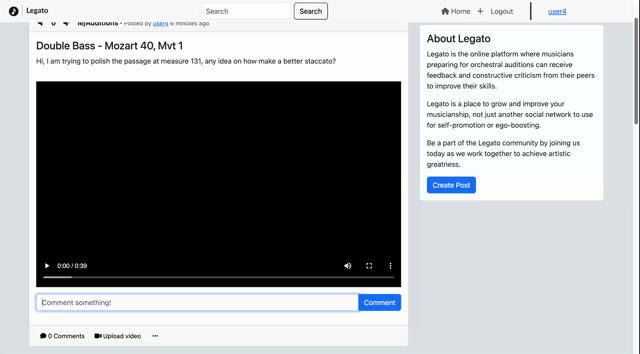

# LEGATO - Flask Blog

## CS50

> This project serves as CS50 final project and aims to explore most of the techniques explained during the class.

> CS, python, flask, flask web framework, web development, javascript, bootstrap, CS50

## Aknowledgments

The inspiration for this project came from [this tutorial](https://github.com/techwithtim/Flask-Blog-Tutorial) by TechWithTim.

## Abstract

My final project is a prototype of a blog / social network aimed to musicians looking to share their video recordings with a community of peers and get feedback on it.

All the backend is stored on Sqlite3 except for the video files upoloads, which for memory reasons I only stored the path of.

The database is connected to flask thorugh SqlAlchemy and two blueprints of the two main paths views.py and auth.py are used to handle the different types of requests.

The website comes with a rating system modeled around Reddit (using their hot algorithm) to sort the posts on the homepage and a search bar to filter the desired posts.

## Features

- User registration and authentication
- Create, read, update, and delete posts
- Leave comments on posts
- Like and dislike posts
- Upload videos to posts
- Search for posts by title or content
- Sort posts by popularity and time of creation
- Display "from now" time on the posts
- Access all the posts from user

## Database:

The database contains five tables:

- **User:** id, email, username, password, date_created

- **Post:** id, title, text, date_created, author_id, video

- **Comment:** id, text, date_created, author_id, post_id

- **Like:** id, date_created, author_id, post_id

- **Dislike:** id, date_created, author_id, post_id

\*In the User and Post tables I also set up a few _db.relationship_ however I found the _passive_deletes_ not to be working, and I chose to implement that logic inside my delete_post function

## Auth path:

This authentication system uses Flask-Login and werkzeug.security to salt and hash the users password.

The SQLALCHEMY_DATABASE_URI configuration variable is set up in the private config.py file to point at the database and in here is also set a SECRET_KEY variable to be passed into **init**.py.

The authentication system provides three routes:

    /signup: Allows a user to sign up for a new account by providing a unique username, email, and password. If the username or email is already taken, or if the password does not meet the system requirements, an error message will be displayed. If the sign-up is successful, the user will be logged in and redirected to the home page.

.

    /login: Allows a user to log in by providing their username and password. If the username does not exist or the password is incorrect, an error message will be displayed. If the log-in is successful, the user will be redirected to the home page.

.

    /logout: Logs out the current user and redirects to the home page.

### Helper Functions

Signup includes two helper functions, _validate_password_ that uses regex to ensure passwords include certain charachters and as an homage to CS50's Finance, _apology_, to handle all bad request statuses.

## Views path:

The views path handles all the requests that allow the user to create, view, and interact with posts.

    /index: the home page of the application, which displays a list of all the posts. The route is only accessible to logged-in users, as defined by the @login_required decorator.

When a user visits the home page, the function queries all the posts and sorts them in reversed chronological order combined with popularity, as determined by the number of likes and dislikes.

```python
# Loop through the posts list of post objects
    for post in posts:
        # Create arguments to be used by the hot function
        date = post.date_created
        ups = len(post.likes)
        downs = len(post.dislikes)
        # Call hot and store result in new .hot_score attribute to post
        post.hot_score = hot(ups, downs, date)

    # Sorted sorts in reverse order a list of Post objects by the key parameter: a lamba function having post.hot_score as argument
    sorted_posts = sorted(posts, key=lambda post: post.hot_score, reverse=True)

```

The function also displays the time elapsed since the post was created using the from_now helper function.

```python
# Loop through the sorted_posts list
    for post in sorted_posts:
        # Create argument to be used by the from_now function
        time_diff = now - post.date_created
        # Call from_now and store result in new .time_passed attribute to post
        post.time_passed = from_now(time_diff)
```

If the user has searched for a particular term, the function filters the posts by title or body containing the search term.

```python
if search:
        # Return a list of Post objects containing search in body or title
        posts = Post.query.filter(Post.title.contains(
            search) | Post.text.contains(search)).all()
```


### Helper Functions

Index includes two helper functions, _hot_ and _from_now_, that calculate the popularity and elapsed time since a post or comment was created, respectively.

    /create-post: When a POST request is sent to the form, if neither the title or the text is empty, the function creates a new post object and adds it to the database. The function then redirects the user to the home page. With a GET request, the function renders the create_post.html template.

.

    /delete-post<id>: Only the author of the post, will be able to delete it. When a post is deleted, all associated comments, likes, dislikes, and video file (if it exists) will also be deleted.

```python
if post.video:
            # Get file path by splitting the post.video at the slash and getting the last component (the file name)
            # Join to the UPLOAD_FOLDER var to get the full path
            file_path = os.path.join(UPLOAD_FOLDER, post.video.split('/')[-1])
            if os.path.exists(file_path):
                # Delete the file from the server
                os.remove(file_path)
```

.

    /upload-video/<post_id>:  This route expects a file to be uploaded via a POST request, and then saves the file to the server's uploads folder. If the file is successfully uploaded, the video path and filename are added to the Post model in the database.

To handle possible duplicates the function creates a unique filename in the format **"post_id-"{post_id}-{original_file_name}"**.

The secure_filename function is used to remove potentially dangerous characters, and if the resulting file path name already exists the user is asked to change the name of the file uploading.

```python
 if file:
        # Create unique filenames based off post_id and pass filename through secure_filename
        filename = "post_id-" + post_id + "-" + secure_filename(file.filename)
        # Create file path adding filename to uploads folder
        file_path = os.path.join(UPLOAD_FOLDER, filename)
        # Check if file_path already exists
        if os.path.exists(file_path):
            flash(
                "A file with this name already exists. Please change your file name.", category="error")
            return redirect(url_for("views.index"))

        file.save(file_path)
```


    /posts/<username>: Queries the User table in the database using the username argument in the URL as a filter and displays all posts made by a specific user

.

    /create-comment/<post_id>: Creates a comment by taking in the post id and comment text from the form. It first checks that the comment text is not empty. If the post exists, the comment is added to the database. If the post does not exist, an error message is flashed.



    /delete-comment/<comment_id>: Deletes a comment by taking in the comment id from the url. First it queries the comment to make sure it exists, then it checks if the user trying to delete the comment is either the author of the comment or the author of the post commented on. If the user has the proper permissions, the comment is deleted from the database.

.

    /like-post/<post_id>: Assigns a like to the post filtered by the post_id argument. If the user hasn't liked or disliked the post before, a like is added to the post. If the user had previously disliked the post, the dislike is removed and a like is added. If the user had previously liked the post, the like is removed.

The last line returns a JSON response containing the difference between likes and dislikes for the post, and a boolean indicating if the user has liked the post.

```python
return jsonify({"votes": len(post.likes) - len(post.dislikes), "liked": current_user.id in map(lambda x: x.author_id, post.likes)})
```

.

    /dislike-post/<post_id>: This route is line by line specular to like-post, handling the dislikes for the current post.

## Index.js

While the focus of the project is on Python and Flask, for the like and dislike buttons I decided to use some Javascript to make them more responsive and avoiding refreshing the page with each vote.

Similarly to the like and dislike routes in Flask, the challenge was finding a way to handle like, removing a like by pressing again the same button, or directly change from like to dislike clicking the dislike button from a like.


## Youtube presentation

Here is youtube [link](https://youtu.be/0Xd4IVIABoU) to my video presentation

## Documentation

https://flask.palletsprojects.com/en/2.2.x/

https://flask-sqlalchemy.palletsprojects.com/en/3.0.x/

https://werkzeug.palletsprojects.com/en/2.2.x/utils/

https://docs.python.org/3/library/datetime.html

https://medium.com/hacking-and-gonzo/how-reddit-ranking-algorithms-work-ef111e33d0d9
